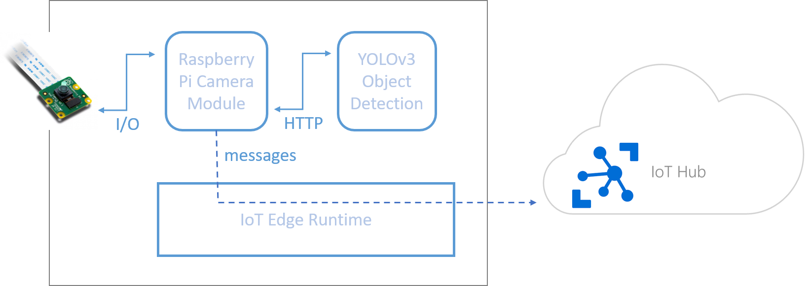

# Bringing Computer Vision models to the Edge with Azure IoT Edge samples

## Overview
This repository hosts the code samples for the [Bringing Computer Vision models to the Edge with Azure IoT Edge - A guide for developers and data scientists](https://github.com/lafius/azure-iot-edge-cv-model-on-raspberry-pi-samples/tree/master/Documentation/Bringing%20Computer%20Vision%20models%20to%20the%20Intelligent%20Edge%20with%20Azure%20IoT%20Edge%20-%20A%20guide%20for%20developers%20and%20data%20scientists.pdf).

The objective of this guide is to walk you through an end-to-end AI object detection on a Raspberry Pi 3 via a series of modules that are entirely customizable with ease. This guide is designed for developers as well as data scientists who wish to easily put their AI models in practice on edge devices without focusing too much on the deployment.

From the training of the YOLOv3 object detection to the deployment on the Raspberry Pi 3, you will have a wide overview of how to build an IoT device performing computer vision models.

## Contents
* [Azure ML Training](https://github.com/lafius/azure-iot-edge-cv-model-on-raspberry-pi-samples/tree/master/Azure%20ML%20Training): contains a notebook to train the state-of-the-art object detection YOLOv3 based on this Keras implementation [repository](https://github.com/qqwweee/keras-yolo3) with Azure Machine Learning.
* [IoT](https://github.com/lafius/azure-iot-edge-cv-model-on-raspberry-pi-samples/tree/master/IoT): contains the IoT solution presented in the guide as well as a notebook to quickly set up an Azure IoT Hub via az commands.

## Contributing

This project welcomes contributions and suggestions.  Most contributions require you to agree to a
Contributor License Agreement (CLA) declaring that you have the right to, and actually do, grant us
the rights to use your contribution. For details, visit https://cla.opensource.microsoft.com.

When you submit a pull request, a CLA bot will automatically determine whether you need to provide
a CLA and decorate the PR appropriately (e.g., status check, comment). Simply follow the instructions
provided by the bot. You will only need to do this once across all repos using our CLA.

This project has adopted the [Microsoft Open Source Code of Conduct](https://opensource.microsoft.com/codeofconduct/).
For more information see the [Code of Conduct FAQ](https://opensource.microsoft.com/codeofconduct/faq/) or
contact [opencode@microsoft.com](mailto:opencode@microsoft.com) with any additional questions or comments.
